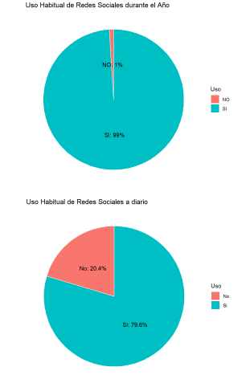
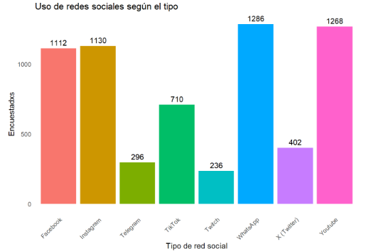
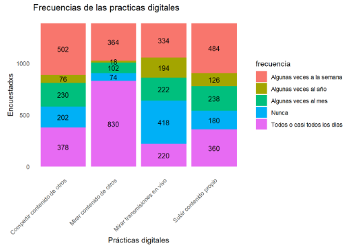

# Proyecto 2 | Uso del tiempo destinado a redes sociales por jóvenes en Argentina (R)

Proyecto de análisis descriptivo de datos desarrollado en **R** mediante un flujo de trabajo reproducible para estudiar los hábitos de uso de redes sociales de jóvenes de 18 a 29 años en Argentina.

---

## Descripción

Este proyecto desarrolla un análisis descriptivo de datos utilizando **R** y **R Markdown**, integrando la importación, preparación, análisis y visualización de datos para generar un informe dinámico en formato HTML.

El estudio se basa en información proveniente de la **Encuesta Nacional de Consumos Culturales (ENCC)** y analiza el uso del tiempo destinado a redes sociales por jóvenes argentinos de entre 18 y 29 años.

El análisis aborda el uso de **YouTube, Instagram, WhatsApp, Facebook, TikTok, X (Twitter), Telegram y Twitch**, además de explorar distintas prácticas digitales relacionadas con el consumo cultural.

---

## Objetivos

Este proyecto tuvo como propósito analizar el uso del tiempo destinado a redes sociales por jóvenes de 18 a 29 años en Argentina.

En particular se buscó:

- Analizar el uso habitual de redes sociales tanto a nivel diario como anual considerando la provincia de residencia de las personas encuestadas.
- Identificar cuáles son las plataformas más utilizadas y aquellas con menor nivel de uso (YouTube, Instagram, WhatsApp, Facebook, TikTok, X (Twitter), Telegram y Twitch).
- Analizar las principales prácticas digitales realizadas en redes sociales y comparar la frecuencia con que los jóvenes las llevan a cabo.

---

## Fuente de datos

Los datos utilizados provienen de la **Encuesta Nacional de Consumos Culturales (ENCC)**, elaborada por la Secretaría de Cultura de la Nación.

Para el desarrollo del proyecto se utilizó una base de datos preparada específicamente para este análisis a partir de información proveniente de dicha encuesta.

La fuente fue consultada durante el año **2024**.

---

## Herramientas utilizadas

- R
- R Markdown
- readxl
- dplyr
- ggplot2
- DT
- knitr

---

## Metodología

El proyecto se desarrolló mediante las siguientes etapas:

1. Importación de datos desde Excel.
2. Preparación y transformación de la base de datos.
3. Análisis descriptivo de las variables sociodemográficas.
4. Análisis del uso habitual de redes sociales.
5. Comparación del uso de las distintas plataformas digitales.
6. Análisis de las prácticas digitales desarrolladas por la población estudiada.
7. Generación automática de un informe dinámico en formato HTML mediante R Markdown.

---

## Visualizaciones

### Uso habitual de redes sociales

### Redes sociales más utilizadas

### Prácticas digitales

---

## Archivos del proyecto

- **Analisis_Redes_Sociales.Rmd** → Código fuente del análisis.
- **Informe_Analisis_Redes_Sociales.html** → Informe dinámico generado con R Markdown.
- **Base_Redes_Sociales.xlsx** → Base de datos utilizada para el análisis.

---

## Relación con otros proyectos

Este proyecto complementa el análisis desarrollado en **Power BI** sobre la misma temática, mostrando un enfoque basado en programación y análisis reproducible.

---

## Autor

**Benicio Armendano**

Licenciado en Sociología | Analista de Datos Junior
